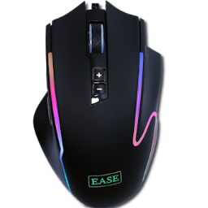
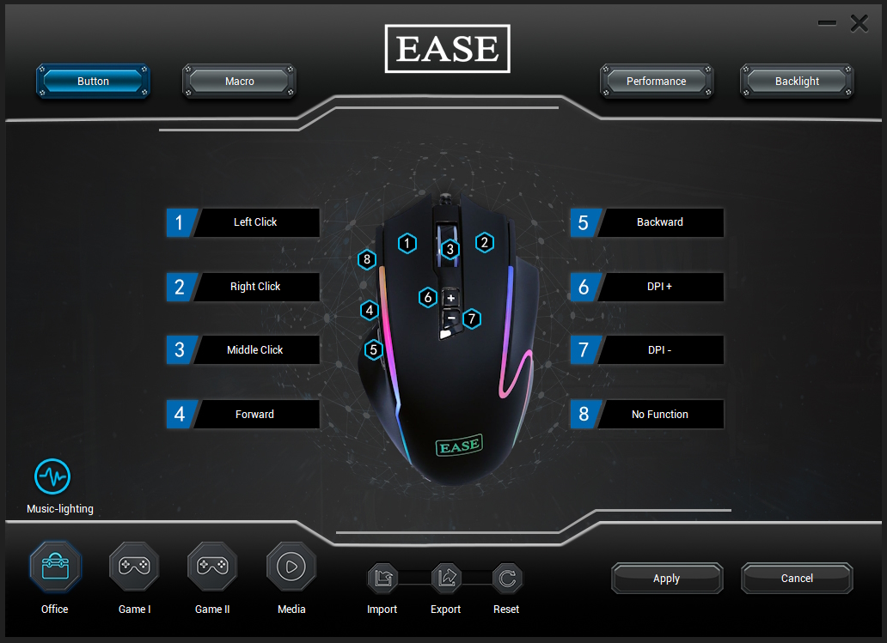
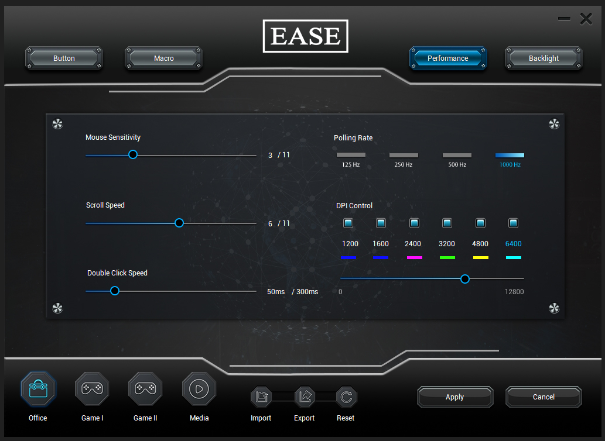
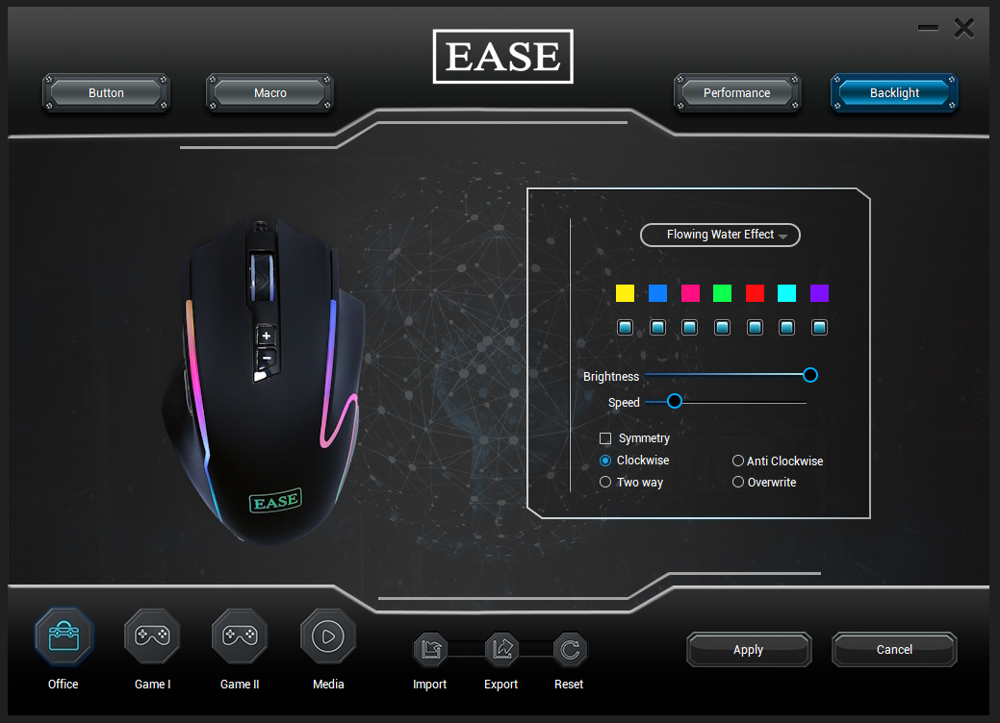

# EASE EGM-110 Gaming Mouse Driver

**Custom driver software to unlock the full potential of the EASE EGM-110 Gaming Mouse**

---

[**Download**](../../releases/latest) · [**Features**](#-features) · [**Installation**](#-installation) · [**Utility Scripts**](#%EF%B8%8F-utility-scripts)

---

## 🔍 Why This Exists

The EASE EGM-110 ships with **no driver software at all** — it's sold as a plug-and-play mouse locked to **500Hz polling rate**, even though the onboard chip fully supports **1000Hz**. There's no official way to change the polling rate, customize buttons, or configure DPI profiles.

So I built this driver from scratch by reverse-engineering and modding the **825F chip driver** to unlock the full potential of this mouse.

---

## 📥 Installation

1. Head to the [**Latest Release**](../../releases/latest)
2. Download **`EASE.EGM-110.Gaming.Mouse.Setup.exe`**
3. Run the installer and follow the prompts
4. Plug in your mouse and launch the software

---

## ✨ Features

### 🖱️ 8 Programmable Buttons

 

Remap all 8 mouse buttons to any of the following functions:

<table>
<tr>
<td>

**Basic**
- Left / Middle / Right Click
- Forward / Backward
- DPI +/- / DPI Loop
- Rapid Fire

</td>
<td>

**Media**
- Play/Pause
- Volume Up/Down
- Next/Prev Track
- Mute

</td>
<td>

**Shortcuts**
- Copy / Paste / Undo
- Select All / Search
- Lock PC / Close Window
- Show Desktop

</td>
<td>

**Advanced**
- Macro assignments
- Profile switching
- LED mode cycling
- Browser / Calculator / Mail

</td>
</tr>
</table>

### ⚡ Polling Rate Unlock

Change the USB polling rate — something the stock mouse doesn't let you do:

| Rate | Response Time | Status |
|:----:|:------------:|:------:|
| 125Hz | 8ms | ✅ |
| 250Hz | 4ms | ✅ |
| 500Hz | 2ms | 🔒 *Stock default* |
| **1000Hz** | **1ms** | 🔓 **Unlocked!** |

### 🎯 DPI Profiles with Onboard Memory

 

- Up to **6 DPI stages** per profile, each individually toggleable
- Assign a **unique RGB color** to each DPI level for quick visual identification
- **All DPI settings are saved directly to the mouse chip** — switch to another PC without the software and your DPI profiles, stages, and colors are all retained

> 💡 **Onboard memory means your settings travel with your mouse — no software needed on other PCs!**

### 🗂️ 4 Configuration Profiles

- **Office, Game I, Game II, Game III** — each with independent button mappings, LED settings, and macros
- Import, export, and reset profiles

### 🌈 RGB LED Customization

 

Extensive backlight control with multiple lighting modes:

| Mode | Description |
|:-----|:------------|
| 🎨 **Steady** | Pick any custom RGB color |
| 💨 **Breathing** | Smooth fade in/out |
| 🔄 **Color Cycle** | 7-color spectrum with customizable palette |
| 🌊 **Wave** | Flowing color wave effect |
| ⚡ **Flicker** | Rapid flash effect |
| ✨ **Starlight** | Twinkling star pattern |
| 💫 **Neon** | Neon glow effect |

- Per-zone LED control with **symmetry**, **clockwise**, **anti-clockwise**, and **two-way flow** directions
- Adjustable **brightness** and **speed**

### 🎵 Audio Sync (Music Lighting)

LED reacts in real-time to audio output — supports **Wave**, **Flicker**, and **Starlight** audio-reactive modes via system speaker or microphone input.

### 🎮 Performance Tuning

- Mouse sensitivity adjustment
- Scroll wheel speed
- Double-click speed
- Rapid fire rate (up to 300ms interval)

### 📝 Macro Editor

- Record and assign macros to any button
- Set repeat count or hold-to-fire mode
- Adjustable delay between keystrokes

---

## 🛠️ Utility Scripts

Two included batch files for quick config changes *(auto-elevate to admin)*:

| Script | Description |
|:-------|:------------|
| **`DisableButton.bat`** | Disable any of the 8 mouse buttons (sets it to None) |
| **`SetRapidFire.bat`** | Assign Rapid Fire to any button (insanely fast auto-clicking while you hold the button down) |

Just double-click either script, pick a button number, and restart the mouse software and click apply.

---

## 📜 License

This project is a driver mod made by me and is not affiliated with EASE or the original 825F chip manufacturer.

---

**If this helped you out, consider giving the repo a ⭐**

